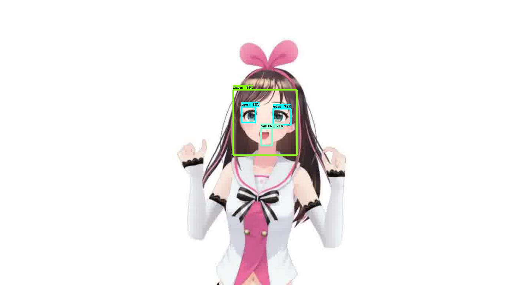
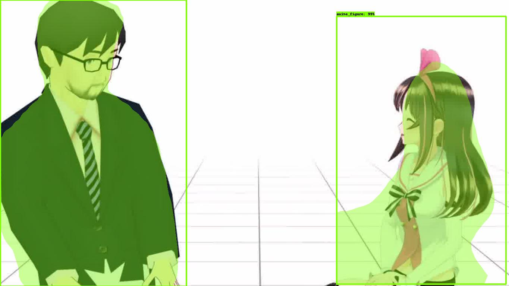
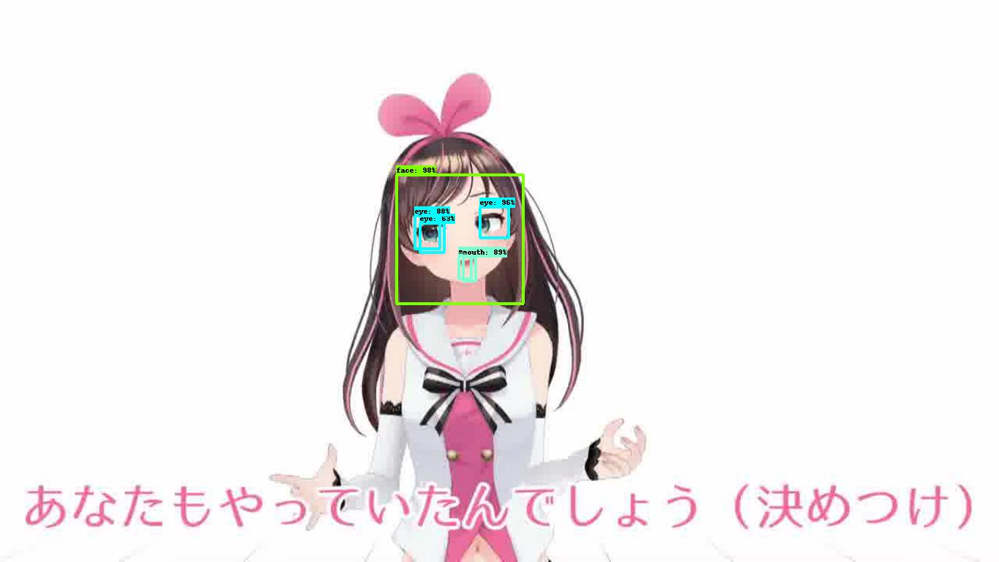
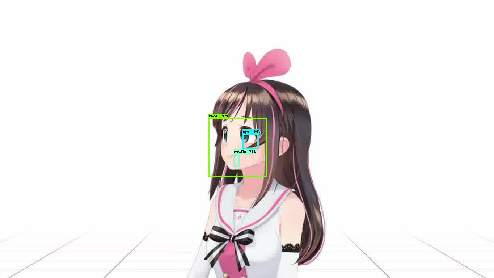
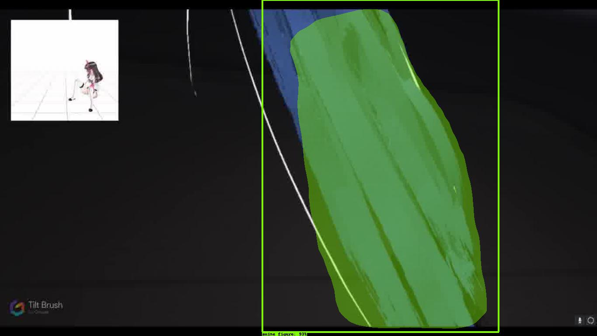
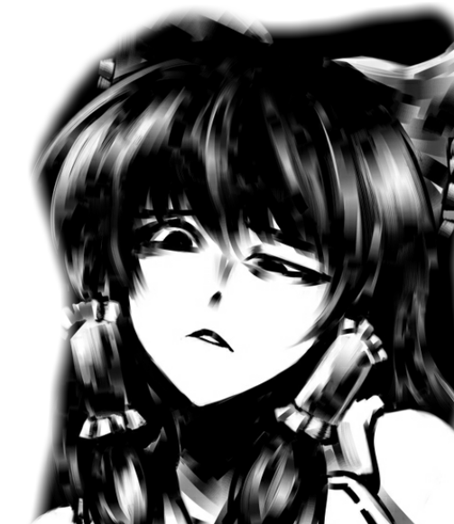

# AniSeg

Tensorflow models for Anime character object detection.

## Samples

### Face detection




### Figure segmentation




## Usage

We provide two pretrained models: One for face detection and one for figure segmentation. Download them at [Google Drive](https://drive.google.com/drive/folders/19PlNcku9V9pcJifSgWoBkZZZQhRDzV0W?usp=sharing)!

Here is a full example script to classify faces in the sample images:

```shell
# Assume you have saved the pretrained models under "model/" directory.

python infer_from_image.py \
--input_images=samples/inputs/*
--output_path=samples/face_detection_outputs
--inference_graph=model/face_detection/frozen_inference_graph.pb
--visualize_inference=True
```

In general, use the script with the following format

```shell
python infer_from_image.py \
--input_images=/PATH/TO/IMAGES/* \
--output_path=/PATH/TO/OUTPUT/FOLDER/  \
--inference_graph=/PATH/TO/frozen_inference_graph.pb  \
--visualize_inference=True
```

For figure segmentation model, please point `--inference_graph` to the segmentation model and add the additional flag

```shell
--detect_masks=True
```

## About the models

The Face Detection is trained on the outputs of [animeface-2009](https://github.com/nagadomi/animeface-2009) detector, which is under the MIT license. The main motivation for a tensorflow version is for **a much faster GPU-based detection** (5-10x speedup). 

The Figure Segmentation model is trained on a manually annotated dataset, which you can download [here](https://drive.google.com/open?id=1fnFbRQKuAUlfgVZnLEapg-rI_Zz5_H5D). Note some images are NSFW. We release this dataset purely for research. **Please use at your own risk.**

To train the model, we overlayed segmented anime figures on top of pure background images to create an artificial dataset. We found this gives a decent performance. You can find pure background images in the [Danbooru 2018](https://www.gwern.net/Danbooru2018) dataset. Please contact us if you'd like to use our pre-generated tfrecords.

Both model is trained using the [Tensorflow Object Detection](https://github.com/tensorflow/models/tree/master/research/object_detection) repo. Our repo is a simplified fork of that.

## Error cases

- Duplicate objects



- False negatives (missing detection)




- False positives



## Anime related repos and datasets

[Danbooru2019 Figures](https://www.gwern.net/Crops#danbooru2019-figures) is a dataset generated by [Gwern](https://github.com/gwern) who ran AniSeg on Danbooru2019 solo SFW images to generate 855k crops of close-up single-character whole-body/profile images. Check out a BIGGAN model trained on that dataset [here](https://www.gwern.net/Faces#danbooru2019e621-256px-biggan).

Shameless self promotion of my [TwinGAN](https://github.com/jerryli27/TwinGAN) model to turn people into anime characteres and cats!

Sketch coloring using [PaintsTransfer](https://github.com/lllyasviel/style2paints) and [PaintsChainer](http://paintschainer.preferred.tech/).

Create anime portraits at [Crypko](https://crypko.ai/) and [MakeGirlsMoe](https://make.girls.moe/#/)

The all-encompassing anime dataset [Danbooru2017](https://www.gwern.net/Danbooru2017) by gwern.

My hand-curated [sketch-colored image dataset](https://github.com/jerryli27/pixiv_dataset).

## Common questions

#### What's the use case?

Getting clean data is hard. The object detectors provided here can make that process easier. For example it can be used to crop faces from the [Danbooru2017](https://www.gwern.net/Danbooru2017) dataset. Here we show some sample results of combining the two mdoels:





#### Results are too noisy

There is always a tradeoff between precision and recall. Please adjust the `--min_score_thresh` flag accordingly. 

Higher threshold means more accurate results but also more false negatives (higher chance to miss objects). Lower value gives more faces but also contains non-face objects.

#### Inference is too slow

Inference using CPU is slow. Please make sure you have a GPU/TPU. 

#### Citation

If you decide to use our model and/or data, we ask you to kindly cite this repo. Have fun!